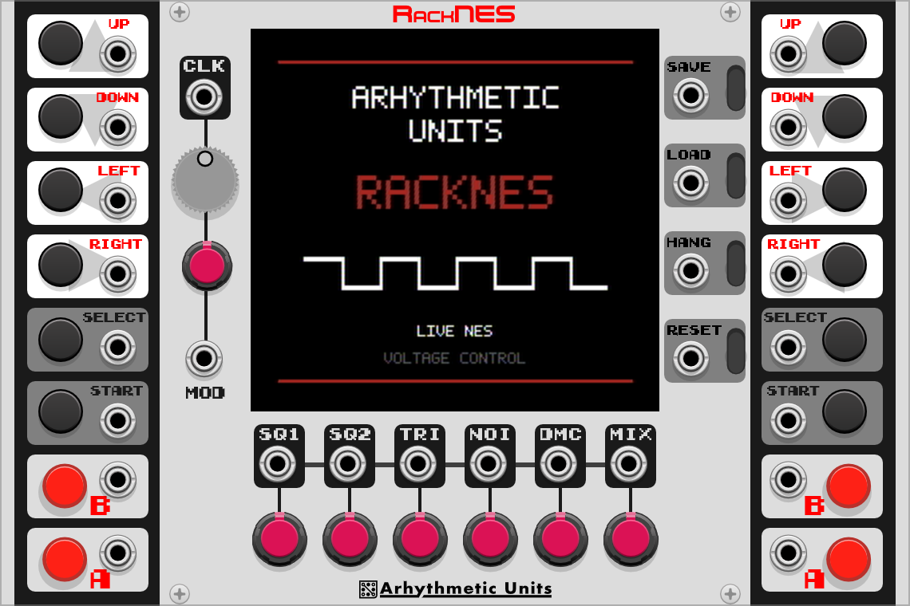
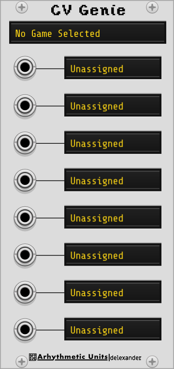

# RackNES

An Arhythmetic Units Nintendo Entertainment System (NES) emulator as if it were
designed by Bob Moog.

<p align="center">

</p>

## Features

-   **Clock Source:** Use NES frame-rate (FPS) as a clock source for downstream
    modules
-   **Clock Rate Modulation:** Control the clock rate of the NES with direct
    knob and CV
-   **NES Audio Output:** Sample audio from the NES in real-time at any
    sampling rate
-   **Sampling/Ratcheting:** Save and restore the NES state for interesting
    musical effects
-   **Full CV Control:** CV inputs for Reset, Player 1, Player 2, and more
-   **Channel Mixer:** Control the volume level of individual synthesizer
    channels

See the [Manual][RackNES] for more information about the features of this
module.

[RackNES]: https://github.com/Kautenja/RackNES/releases/latest/download/RackNES.pdf

## CV Genie

CV Genie is a Game Genie emulator and expander module for RackNES developed by
[@anlexmatos][anlexmatos]!

<p align="center">

</p>

See the [Manual][CVGenie] for more information about the features of this
module.

[CVGenie]: https://github.com/Kautenja/RackNES/releases/latest/download/CVGenie.pdf

## Building The Manuals

The [manual guide](manual/README.md) covers the shared LaTeX build, content
verification, PDF review, and release workflow. Build both manuals without
the Rack SDK using:

```shell
make -C manual
```

The PDFs are written to `manual/RackNES/.build/manual.pdf` and
`manual/CVGenie/.build/manual.pdf`. The guides cover the controls and limitations
of the current implementation, including all built-in CV Genie memory mappings.
Panel guides use LaTeX wireframes; covers and the images above share captures
of the production widgets. The [capture guide](tools/capture/README.md) explains
how to regenerate them with the original Arhythmetic Units demo ROM.

## Citation

The technical report, [**RackNES: A Voltage-Controlled NES Emulator as a Musical
Instrument**](whitepaper/README.md), describes the project's foundations, related
work, architecture, and implementation. Its [standalone LaTeX source](whitepaper/racknes.tex)
includes the bibliography and architecture diagram; the report README provides
PDF build instructions.

To cite the project and its implementation account, use the report entry below.
GitHub's **Cite this repository** button uses the preferred citation in
[CITATION.cff](CITATION.cff); [CITATION.bib](whitepaper/CITATION.bib) provides the
same BibTeX entry.

```bibtex
@techreport{kauten2026racknes,
  author      = {Kauten, Christian},
  title       = {{RackNES}: A Voltage-Controlled {NES} Emulator as a Musical Instrument},
  institution = {Arhythmetic Units},
  year        = {2026},
  month       = sep,
  type        = {Technical report},
  note        = {Manuscript version 1, dated September 30, 2026; repository manuscript},
  url         = {https://github.com/Kautenja/RackNES/tree/master/whitepaper},
}
```

When referencing the software, link to this repository and identify the version
or commit used. The report documents RackNES 2.1.0 at source revision
[`e8c99bf86295318724ef62ad40a17ba6897be696`](https://github.com/Kautenja/RackNES/tree/e8c99bf86295318724ef62ad40a17ba6897be696).
It is currently a repository manuscript without an assigned DOI or conference
publication status.

## License

RackNES source code is licensed under [GPL-3.0-or-later](LICENSE). The module
graphics and branding in `res/` and `manual/` are separately licensed under
[CC BY-NC-ND 4.0](docs/licenses/CC-BY-NC-ND-4.0.txt). Bundled dependencies retain
their own license notices.

See [LICENSING.md](LICENSING.md) for the scope of each license and
[third-party notices](docs/licenses/THIRD-PARTY.txt) for bundled components.
The software license does not grant the same permissions for the artwork.

## Acknowledgments

The code for the module derives from:

1.  the NES emulator, [SimpleNES][SimpleNES];
2.  the NES synthesis library, [Nes_Snd_Emu][Nes_Snd_Emu];
3.  the NES NTSC filter library [nes_ntsc][nes_ntsc]; and
3.  the Base64 library, [cpp-base64][cpp-base64].

[SimpleNES]: https://github.com/amhndu/SimpleNES
[Nes_Snd_Emu]: https://www.slack.net/~ant/libs/audio.html#Nes_Snd_Emu
[nes_ntsc]: http://slack.net/~ant/libs/ntsc.html#nes_ntsc
[cpp-base64]: https://github.com/ReneNyffenegger/cpp-base64

## Support

See [SUPPORT.md](SUPPORT.md) for manuals, troubleshooting resources, questions,
bug reports, and feature requests.

## Contributing

See [CONTRIBUTING.md](CONTRIBUTING.md) for environment setup, architecture,
builds, regression checks, and pull request guidance. Coding agents should
also follow [AGENTS.md](AGENTS.md).

## Contributors

Many thanks to [@anlexmatos][anlexmatos] for developing the _CV Genie_ expander
module.

[anlexmatos]: https://github.com/anlexmatos
