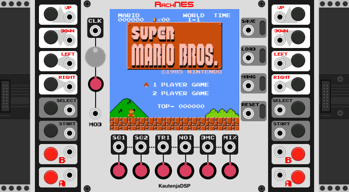

# RackNES

[![Travis CI Build Status][BuildStatus]][BuildServer]

[BuildStatus]:  https://travis-ci.org/Kautenja/RackNES.svg?branch=master
[BuildServer]:  https://travis-ci.org/Kautenja/RackNES

A Nintendo Entertainment System (NES) emulator as if it were designed by Bob Moog.

## Features

- **Clock Source:** Use NES frame-rate (FPS) as a clock source for downstream modules
- **Clock Rate Modulation:** Control the clock rate of the NES with direct knob and CV
- **NES Audio Output:** Sample audio from the NES in real-time at any sampling rate
- **Sampling/Ratcheting:** Save and restore the NES state for interesting musical effects
- **Full CV Control:** CV inputs for Reset, Player 1, Player 2, and more
- **Channel Mixer:** Control the volume level of individual synthesizer channels

See the [Manual][RackNES] for more information about the features of this module.

[RackNES]: https://github.com/Kautenja/RackNES/releases/latest/download/RackNES.pdf

## Acknowledgments

The code for the module derives from:

1. the NES emulator, [SimpleNES](https://github.com/amhndu/SimpleNES);
2. the NES synthesis library, [Nes_Snd_Emu](https://www.slack.net/~ant/libs/audio.html#Nes_Snd_Emu);
3. the NES NTSC filter library [nes_ntsc](http://slack.net/~ant/libs/ntsc.html#nes_ntsc); and
3. the Base64 library, [cpp-base64](https://github.com/ReneNyffenegger/cpp-base64).
